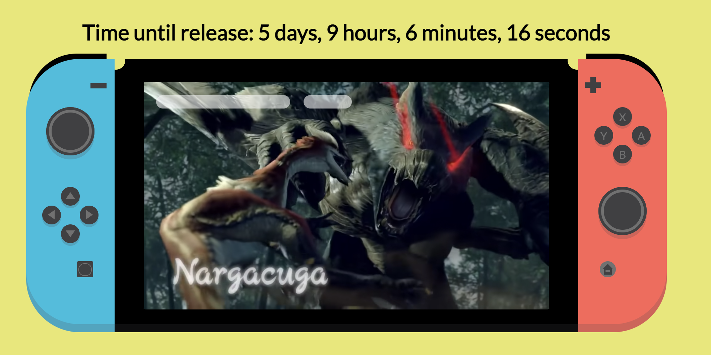

# SCSS Nintendo Switch

Nintendo Switch made entirely out of divs and SCSS. See it live: http://switch-scss.netlify.app/ (doesn't work well on mobile - better if you view on desktop)

Built in VS Code with the extension "Live Server" and npm module [node-sass](https://www.npmjs.com/package/node-sass) - if you want to run this locally that's probably the easiest way. I haven't committed the style.css file for this reason, so you won't just be able to open the index.html file without compiling the SCSS (which node-sass takes care of for you). Alternatively, there is a VS Code extension "Live Sass Compiler" which will do most of that for you too.

Routes:

- /
- /monster-hunter-countdown.html

---

## Screenshots

### Screenshot of the Switch

### Screenshot of the Switch with embedded YouTube video & countdown timer

